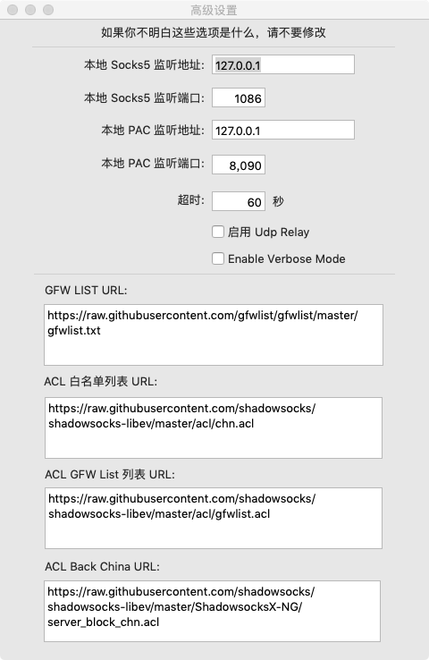
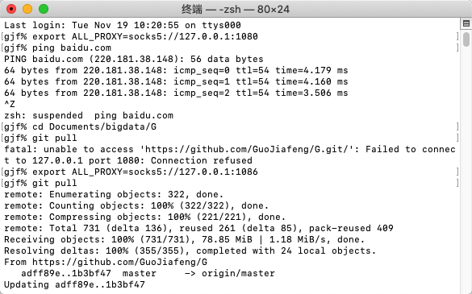

本地需要开启socks5监听

> 开一个SSR|SS就行，通过代理服务器访问github

参考  https://segmentfault.com/a/1190000018813121?utm_source=tag-newest

~~~
 在命令行中临时开启 
 export ALL_PROXY=socks5://127.0.0.1:1086
 
~~~

## 使用后

> 使用前为10K

