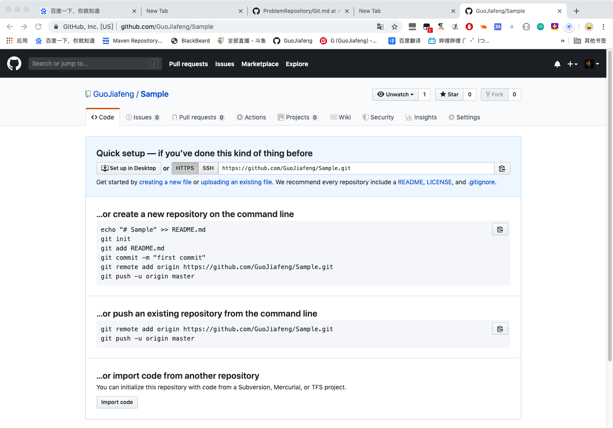

## 初始化

```
echo "# Sample" >> README.md
git init
git add README.md
git commit -m "first commit"
git remote add origin https://github.com/GuoJiafeng/Sample.git
git push -u origin master
```


```
git remote add origin https://github.com/GuoJiafeng/Sample.git
git push -u origin master
```

